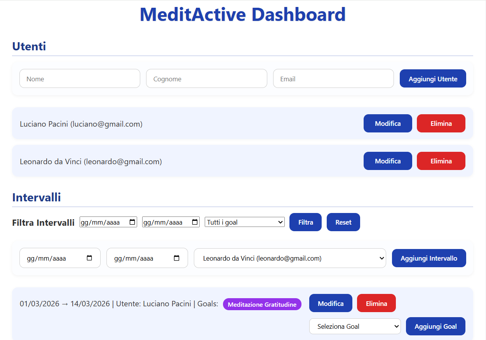

# MeditActive

**MeditActive** è una dashboard web per gestire utenti, intervalli di tempo e meditazioni (goal).  
Permette di aggiungere, modificare e cancellare utenti e intervalli, associare obiettivi agli intervalli, e filtrare gli intervalli per date o per obiettivi.  
Il progetto è pensato per essere semplice, intuitivo e pronto per il portfolio di uno sviluppatore full-stack.

## 📸 Anteprima del progetto

Ecco un’anteprima della dashboard **MeditActive**, con utenti e goal visibili:



---

## 🛠 Tecnologie utilizzate
 
 
 


 
 


---

## ⚡ Funzionalità principali

### Utenti
- Creazione, modifica e cancellazione di utenti  
- Ogni utente ha: nome, cognome, email  

### Intervalli
- Creazione, modifica e cancellazione di intervalli associati a un utente  
- Ogni intervallo ha: data inizio, data fine, utente di riferimento  
- Filtri disponibili: intervalli per **date** e per **goal**  

### Goal / Meditazioni
- Visualizzazione dei goal disponibili  
- Associazione di goal agli intervalli  
- Visualizzazione pulita delle date nel frontend (formato leggibile)

---

## 🚀 Installazione e avvio

# 1. Clona il repository (monorepo)
```bash
git clone https://github.com/lucianopacini/progetto-node.js-di-Luciano-Pacini.git
cd progetto-node.js-di-Luciano-Pacini
```

# 2. Avvia il database (MySQL)
Il progetto utilizza MySQL in locale.

1. Apri XAMPP
2. Clicca su Start per:
- Apache
- MySQL

⚠️ Senza MySQL attivo, il backend non funzionerà (errore ECONNREFUSED)

# 3. Avvio Backend
```bash
cd meditactive-api
npm install
npm start
```

Il backend sarà disponibile su:
👉 http://localhost:5000

# 4. Avvio Frontend (React)
Apri un secondo terminale:
```bash
cd meditactive-frontend
npm install
npm start
```

Il frontend sarà disponibile su:
👉 http://localhost:3000

---

## ⚙ Struttura del Progetto (monorepo)
Backend:
https://github.com/lucianopacini/progetto-node.js-di-Luciano-Pacini/tree/main/meditactive-api
Frontend:
https://github.com/lucianopacini/progetto-node.js-di-Luciano-Pacini/tree/main/meditactive-frontend

## 🔗 API principali

### Utenti
- `GET /api/users` → Lista utenti  
- `POST /api/users` → Aggiungi utente  
- `PUT /api/users/:id` → Modifica utente  
- `DELETE /api/users/:id` → Cancella utente  

### Intervalli
- `GET /api/intervals` → Lista intervalli (con filtri opzionali: `start`, `end`, `goalId`)  
- `POST /api/intervals` → Aggiungi intervallo  
- `PUT /api/intervals/:id` → Modifica intervallo  
- `DELETE /api/intervals/:id` → Cancella intervallo  

### Associare goal
- `POST /api/intervals/:id/goals` → Associa un goal a un intervallo  

### Meditazioni / Goal
- `GET /api/meditations` → Lista goal disponibili  

---

## 📝 Note importanti
- Tutte le query al database usano **prepared statements** → protezione da SQL injection  
- Il frontend aggiorna utenti e intervalli senza ricaricare la pagina  
- Le date sono visualizzate in formato leggibile per una migliore UX  

---

## 💡 Suggerimenti
- Assicurati che il backend sia avviato prima del frontend
- Il frontend comunica con il backend su http://localhost:5000/api
- Se modifichi le porte, aggiorna anche le chiamate API nel frontend

## 😎 Miglioramenti futuri
- Possibile estendere il progetto con autenticazione, notifiche e grafici sulle meditazioni.
- Deploy previsto (in fase di sviluppo).

---

## 👨‍💻 Autore
**Luciano Pacini** – sviluppatore full-stack in crescita 🌞🦁
